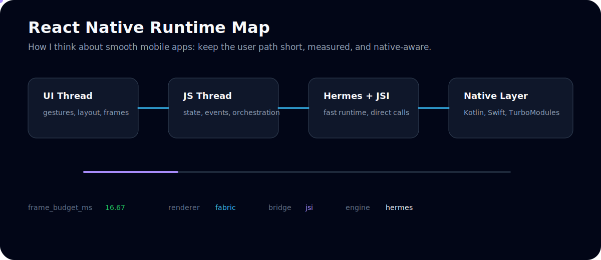
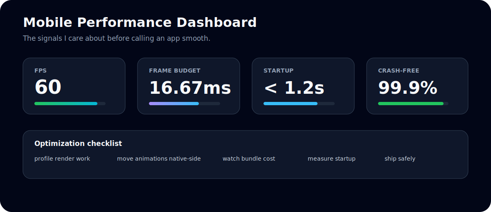
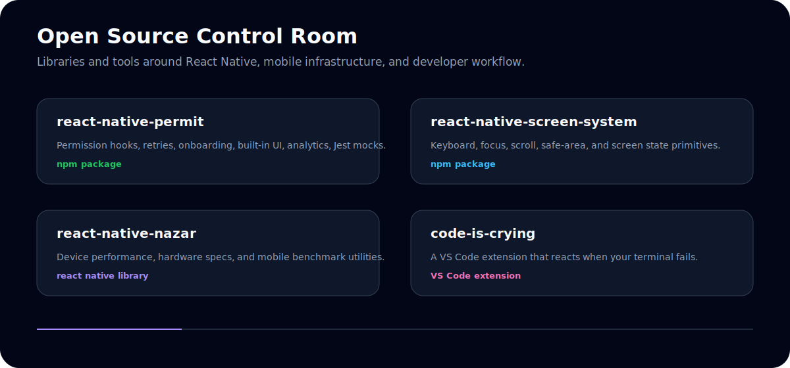
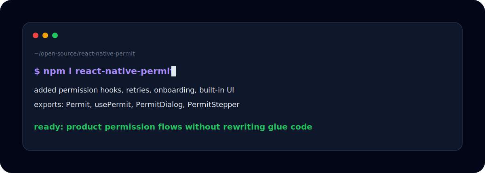
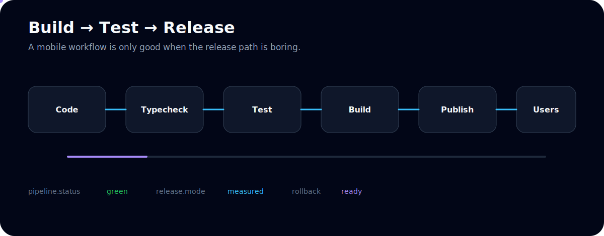

<div align="center">
  
</div>

<div align="center">
  
</div>

<p align="center">
  <a href="https://linkedin.com/in/prakhardubey13"></a>
  <a href="https://github.com/prakharcodehere"></a>
  <a href="https://www.npmjs.com/~prakharcodehere"></a>
  
</p>

---

## About Me

```ts
const prakhar = {
  name: 'Prakhar Dubey',
  role: 'React Native Developer / SDE-1',
  focus: ['mobile performance', 'smooth UX', 'native bridges', 'developer tools'],
  stack: ['React Native', 'TypeScript', 'Reanimated', 'Kotlin', 'Swift', 'Node.js'],
  exploring: ['RN New Architecture', 'TurboModules', 'JSI', 'Hermes'],
  mindset: 'Ship fast, keep it smooth, measure what matters.',
};
```

I build React Native/mobile apps with a focus on performance, clean UI, native integrations, and developer experience.

---

## Mobile Runtime



---

## Performance Mindset



---

## Published Work



### npm Packages

| Package | What it does | Links |
| --- | --- | --- |
| `react-native-permit` | Permission hooks, retry flows, modal/bottom-sheet/screen UI, onboarding, analytics, and Jest mocks | [npm](https://www.npmjs.com/package/react-native-permit) · [GitHub](https://github.com/prakharcodehere/react-native-permit) |
| `react-native-screen-system` | Screen infrastructure for keyboard, focus, scroll, safe-area, and state primitives | [npm](https://www.npmjs.com/package/react-native-screen-system) · [GitHub](https://github.com/prakharcodehere/react-native-screen-system) |
| `react-native-nazar` | Device performance, hardware specs, and benchmark utilities for React Native | [GitHub](https://github.com/prakharcodehere/react-native-nazar) |

### VS Code Extension

| Extension | What it does | Link |
| --- | --- | --- |
| `code-is-crying` | A VS Code extension that reacts when your terminal fails | [GitHub](https://github.com/prakharcodehere/code-is-crying) |

---

## Package Terminal



---

## Release Workflow



---

## Tech Stack

| Area | Tools |
| --- | --- |
| Mobile | React Native, TypeScript, React Navigation |
| Animation | Reanimated, Gesture Handler, Skia, Lottie |
| State | Redux Toolkit, Zustand, React Query |
| Native | Kotlin, Swift, TurboModules, JSI |
| Performance | Hermes, Flipper, profiling, bundle analysis |
| Delivery | Fastlane, EAS Build, CodePush, CI/CD |
| Testing | Jest, React Native Testing Library |

---

## GitHub Activity

<div align="center">
  
  
</div>

<div align="center">
  
</div>

---

## Contribution Snake

<picture>
  <source media="(prefers-color-scheme: dark)" srcset="https://raw.githubusercontent.com/prakharcodehere/prakharcodehere/output/github-contribution-grid-snake-dark.svg" />
  <source media="(prefers-color-scheme: light)" srcset="https://raw.githubusercontent.com/prakharcodehere/prakharcodehere/output/github-contribution-grid-snake.svg" />
  
</picture>

---

## Featured Repositories

<div align="center">
  <a href="https://github.com/prakharcodehere/react-native-permit">
    
  </a>
  <a href="https://github.com/prakharcodehere/react-native-screen-system">
    
  </a>
</div>

<div align="center">
  <a href="https://github.com/prakharcodehere/react-native-nazar">
    
  </a>
  <a href="https://github.com/prakharcodehere/code-is-crying">
    
  </a>
</div>

---

## Reach Me

<p align="center">
  <a href="https://linkedin.com/in/prakhardubey13"></a>
  <a href="https://github.com/prakharcodehere"></a>
  <a href="https://www.npmjs.com/~prakharcodehere"></a>
</p>

<div align="center">
  
</div>
